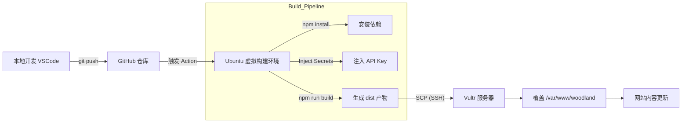

# 🚀 Woodland Mango 进阶运维与 DevOps 实战指南

> **版本**：v1.1 (DevOps & Security Extension)
> **更新日期**：2025-11-27
> **涵盖模块**：Umami 统计、GitHub Actions CI/CD、GPG 异地加密备份

---

## 1. 流量统计体系 (Umami Analytics)

摒弃了臃肿的 Google Analytics，采用了自建的轻量级、隐私友好型统计方案。

### 📊 架构逻辑
* **流量入口**：`stats.woodland-mango.click` (经由雷池 WAF 443端口)
* **内部转发**：WAF 反向代理 -> Docker 容器 `umami` (端口 3000)
* **数据采集**：前端 `index.html` 植入 JS 探针 -> 异步上报
* **数据存储**：PostgreSQL 数据库 (Docker 容器 `umami_db`)

### 🛠️ 部署信息
| 配置项 | 详细信息 |
| :--- | :--- |
| **访问地址** | [https://stats.woodland-mango.click](https://stats.woodland-mango.click) |
| **部署路径** | `/data/umami/` |
| **配置文件** | `docker-compose.yml` |
| **管理账号** | `admin` (已修改默认密码) |

---

## 2. CI/CD 自动化流水线 (Continuous Deployment)

实现了“代码提交即发布”的现代化开发流程，彻底告别 FTP/SFTP 手动上传。

### 🔄 自动化流程图



### 🔑 关键配置 (GitHub Secrets)
为了保护敏感信息，以下变量存储在 GitHub 仓库设置中，构建时动态注入：

* **`HOST`**: 服务器 IP (`64.23.227.107`)
* **`USERNAME`**: SSH 登录用户 (`lymangos`)
* **`SSH_KEY`**: 专用的 SSH 私钥 (无密码)
* **`VITE_GEMINI_API_KEY`**: Gemini AI 的密钥 (构建时注入前端)

### 📝 开发规范
1.  **本地开发**：修改代码 -> `npm run dev` 测试。
2.  **发布上线**：`git add .` -> `git commit` -> `git push`。
3.  **禁止操作**：**严禁**直接 SSH 登录服务器修改 `/var/www/woodland` 下的代码，否则会被下次部署覆盖。

---

## 3. 灾难恢复与异地备份 (Disaster Recovery)

构建了军事级别的数据备份策略：**打包 + GPG 加密 + Google Drive 异地存储**。

### 🛡️ 备份策略
* **频率**：每天凌晨 04:00 (服务器时间)
* **内容**：
    * 网站源代码 (`/var/www/woodland`)
    * Nginx 配置文件 (`/etc/nginx`)
    * SSL 证书 (`/etc/letsencrypt`)
    * Umami 数据库数据 (`/data/umami`)
    * 雷池 WAF 配置与证书 (`/data/safeline/...`)
* **目的地**：Google Drive -> `Backups` 文件夹

### 📂 脚本与路径
| 组件 | 路径 |
| :--- | :--- |
| **自动脚本** | `/root/scripts/backup.sh` |
| **GPG 公钥** | 存储于服务器 GPG Keyring (用户: `lymangos`) |
| **GPG 私钥** | **[重要]** 已导出并保存于本地 Windows 电脑 (`woodland_private.key`) |
| **Rclone 配置** | `/home/lymangos/.config/rclone/rclone.conf` |

### 🚑 恢复指南 (How to Restore)
假设服务器彻底损毁，在新服务器恢复数据的步骤：

1.  **下载备份**：从 Google Drive 下载最新的 `.tar.gz.gpg` 文件。
2.  **导入私钥**：
    ```bash
    gpg --import woodland_private.key
    ```
3.  **解密数据**：
    ```bash
    gpg --output restore.tar.gz --decrypt backup_file.gpg
    ```
4.  **解压归档**：
    ```bash
    tar -xzf restore.tar.gz -C /
    ```

---

## 4. 常用维护命令速查

### 🔍 检查 CI/CD 状态
* 访问 GitHub 仓库 -> **Actions** 标签页。

### 🔍 检查备份日志
```bash
# 查看最近一次备份的运行日志
cat /var/log/woodland_backup.log
```

### 🔍 手动触发备份
```bash
# 如果想立即备份一次
sudo /root/scripts/backup.sh
```

### 🔍 检查 Umami 状态
```bash
cd /data/umami
docker compose ps
# 如果挂了，重启：
docker compose restart
```

---

> **结语**
>
> 现在的 Woodland Mango 不仅仅是一个网站，它是一个集成了 **DevOps 自动化**、**全链路监控** 和 **金融级容灾备份** 的现代化 Web 系统。
> * **开发**：只需关注代码。
> * **运维**：系统自动托管。
> * **安全**：固若金汤。