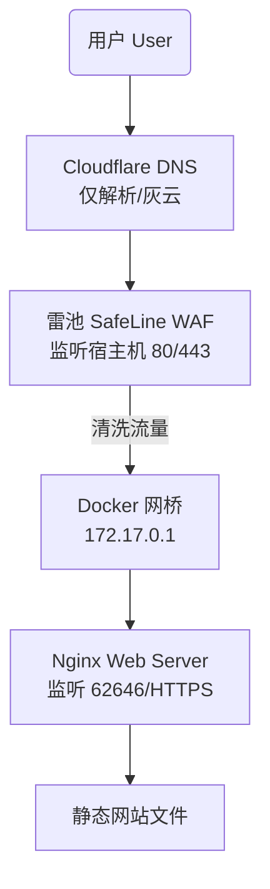

# 个人服务器高可用安全架构部署指南

> **项目**：Woodland Mango (woodland-mango.click)
> **环境**：Vultr (Ubuntu) + Nginx + Docker
> **时间**：2025-11-27

---

## 1. 架构总览 (Architecture)

本次部署将传统的单体 Web 服务器改造为具备 **WAF 防护**、**全站加密**、**自动化运维** 的企业级分层架构。

### 流量流向图



---

## 2. 核心实施步骤 (Implementation Log)

### 第一阶段：DNS 接管与优化
* **操作**：将域名解析权从 NameSilo 迁移至 Cloudflare。
* **关键配置**：
    * **Proxy Status**：设置为 **DNS Only (灰云)**。
    * **目的**：放弃 Cloudflare 的 CDN 中转，换取国内用户直连 Vultr 服务器的低延迟访问速度，避免“减速云”效应。

### 第二阶段：自动化 SSL 证书体系
* **工具**：Certbot + Cloudflare DNS API 插件。
* **成果**：获取了 `*.woodland-mango.click` 通配符证书。
* **自动化机制**：
    1.  **自动申请**：利用 DNS 记录验证归属权，无需 Nginx 停机。
    2.  **自动续期**：Systemd Timer 每天检查两次，剩余 30 天自动续期。
    3.  **自动部署**：配置 `reload-nginx.sh` 钩子，续期成功后自动重启 Nginx。

### 第三阶段：部署雷池 (SafeLine) WAF
* **部署方式**：Docker 容器化部署。
* **端口移交 (Port Shifting)**：
    * **雷池**：接管皇位端口 `80` 和 `443`（对外门户）。
    * **Nginx**：退居幕后，端口改为 `62645` (HTTP) 和 `62646` (HTTPS)。
    * *注：62646 对应 T9 键盘上的 M-A-N-G-O (芒果)。*
* **配置要点**：
    * **上游服务器**：填写 `https://172.17.0.1:62646` (Docker 网关 IP)。
    * **证书加载**：将 Certbot 生成的 `fullchain.pem` 和 `privkey.pem` 填入雷池。
    * **强制跳转**：在雷池“通用配置”中开启 `HTTP 自动跳转到 HTTPS`，实现全站加密。

### 第四阶段：立体化监控
* **内部监控**：雷池 Dashboard (查看攻击拦截、QPS)。
* **外部监控**：UptimeRobot (每 5 分钟检查一次 HTTPS 连通性，宕机邮件报警)。

---

## 3. 运维备忘录 (Cheat Sheet)

### 📁 关键文件路径

| 用途 | 路径 |
| :--- | :--- |
| **Nginx 配置** | `/etc/nginx/sites-available/woodland` |
| **SSL 证书 (公钥)** | `/etc/letsencrypt/live/woodland-mango.click-0001/fullchain.pem` |
| **SSL 私钥** | `/etc/letsencrypt/live/woodland-mango.click-0001/privkey.pem` |
| **Certbot 凭证** | `~/.secrets/certbot/cloudflare.ini` (权限 600) |
| **雷池安装目录** | `/data/safeline` (默认) |

### 🛠 常用维护命令

**1. Nginx 相关**
```bash
# 修改配置后检查语法
sudo nginx -t

# 重启 Nginx (修改端口或配置后用)
sudo systemctl restart nginx
```

**2. SSL 证书相关**
```bash
# 手动测试证书续期 (检查自动化是否正常)
sudo certbot renew --dry-run

# 查看当前所有证书信息
sudo certbot certificates
```

**3. 雷池 WAF 相关**
```bash
# 忘记雷池登录密码？重置密码命令
docker exec safeline-tengine awk -F: '/^admin/{print $2}' /usr/local/nginx/conf/htpasswd

# 升级雷池版本
bash -c "$(curl -fsSLk https://waf-ce.chaitin.cn/release/latest/upgrade.sh)"
```

**4. 端口排查**
```bash
# 查看谁占用了 80 端口
sudo ss -tulpn | grep :80
```

---

## 4. 知识点总结 (Key Learnings)

通过这次部署，你掌握了以下核心技能：

1.  **反向代理逻辑**：理解了流量是如何层层转发的（WAF -> Nginx）。
2.  **安全分层**：
    * 网络层：Cloudflare 隐藏 DNS 细节。
    * 应用层：雷池 WAF 拦截恶意请求。
    * 传输层：TLS/SSL 全链路加密。
3.  **Docker 网络**：学会了容器如何通过 `172.17.0.1` 访问宿主机的服务。
4.  **权限管理**：理解了 Linux 中 `root` 权限的重要性以及 `chmod 600` 对敏感文件的保护作用。
5.  **问题解决思路**：遇到功能限制（如雷池专业版限制）时，懂得通过架构调整（分端口、Nginx代码、全局配置）来寻找替代方案。

---

> **写在最后**
> 现在的 **Woodland Mango** 已经是一座坚固的数字堡垒。它跑得快、很安全、且全自动。Enjoy! 🚀